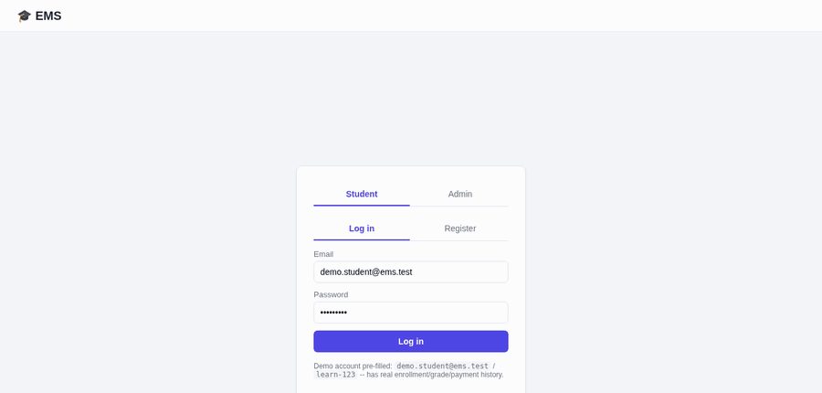

# Education Management System (EMS)

A production-style academic backend built to the milestone curriculum in
[`../docs/3.EMS_DB`](../docs/3.EMS_DB): requirements → domain modeling → ER
diagram → normalized PostgreSQL schema → seed data → a layered Python
backend (repository + service pattern) → the full academic workflow
(enrollment, attendance, grading, payments, certificates) → **advanced
PostgreSQL** (CTEs, window functions, recursive queries, materialized
views, JSONB, full-text search) → a web UI → tests → `EXPLAIN ANALYZE`
optimization notes.

Everything — database, backend API, and the web UI — runs from a single
`docker compose up`. No local Python environment or `venv` is required.



## Quickstart (Docker only)

```bash
cd EMS_DB
make up      # or: docker compose up -d --build
make seed    # loads a realistic demo dataset (idempotent -- safe to re-run)
```

| Service    | What it is                                         | URL                          |
|------------|-----------------------------------------------------|-------------------------------|
| `postgres`   | PostgreSQL 16, schema loaded automatically on first boot | `localhost:5433` (for a DB client) |
| `backend`    | Flask API + the web UI (static files served by the same app) | **http://localhost:5001**   |

Open **http://localhost:5001** — that's the whole app. **Login is demo
mode: any email and any password gets you in**, as either role — the
password is never checked, and typing an email with no account yet
creates one automatically (a student gets assigned a default
department; an admin account needs nothing else). Two accounts come
pre-seeded with real history if you want to start from data instead of
a blank slate:

| Role | Email | Notes |
|---|---|---|
| Student | `demo.student@ems.test` | Real enrollment/attendance/grade history; one deliberately unpaid invoice so you can see the payment-blocks-certificate flow live |
| Admin | `admin@ems.test` | Registrar staff account |

(Any password works for these too — they're not gated behind
`learn-123` / `admin-123`, those just happen to be what the seed script
set.)

## Learn it interactively (Makefile)

`make help` lists one command per step of the academic workflow *and*
one command per advanced PostgreSQL feature — each printing the HTTP
call and the SQL/PostgreSQL concept underneath it:

```bash
make demo        # watch the full lifecycle happen, narrated, against a throwaway account
make db-shell     # then go look at the rows/views it touched yourself
make explain      # real EXPLAIN ANALYZE plans, including a bug this project hit and fixed
```

Full guided tour, staged from "look at the schema" through every CTE,
window function, recursive query, materialized view, and JSONB query in
this codebase: **[`docs/04_interactive_learning.md`](docs/04_interactive_learning.md)**.

## Using the UI

**As a student** (log in with the demo account above, or register a new
one):
1. **Dashboard** — your GPA, attendance %, enrollment count, pending
   payments (reads `student_dashboard_view`).
2. **Browse Courses** — full-text search (try "programming"), filter by
   department, see each course's prerequisite chain, enroll (semester
   defaults to the active one).
3. **My Enrollments** — every enrollment with its computed grade (if
   finalized) and an expandable attendance summary.
4. **Payments** — pay a pending invoice.
5. **Certificates** — request one. With the demo account, do this
   *before* paying to see it blocked (`402 PaymentRequiredError`), then
   pay, then request again.

**As admin** (`admin@ems.test` / `admin-123`):
1. **Dashboard** — institution-wide totals (`admin_dashboard_view`).
2. **Departments** — the School → Department hierarchy, rendered from a
   recursive CTE.
3. **Reports** — Department Report (CTE), GPA Rankings (window
   functions, overall + per-department rank in one query, filterable),
   Semester Report (materialized view, with a live "refresh" button —
   `REFRESH MATERIALIZED VIEW CONCURRENTLY`).
4. **Directory** — full-text search teachers/students by name.
5. **JSONB Explorer** — query `assignments.settings` by key existence
   (`late_penalty`) or by field + cast (`submission_deadline < date`).

### What each screenshot demonstrates

| Screenshot | Shows |
|---|---|
| `docs/screenshots/02_student_dashboard.png` | Student dashboard view |
| `docs/screenshots/04_course_browse_cs.png` | Course catalog, department-filtered |
| `docs/screenshots/05_enrollments_grades_attendance.png` | Computed grades + attendance across semesters |
| `docs/screenshots/07_certificate_blocked.png` | Certificate request blocked by an unpaid invoice (402) |
| `docs/screenshots/08_certificate_issued.png` | Same request succeeding after payment |
| `docs/screenshots/10_department_hierarchy.png` | Recursive CTE: the School → Department tree |
| `docs/screenshots/12_report_gpa_window.png` | Window functions: `RANK()` overall + per-department |
| `docs/screenshots/13_report_semester_matview.png` | Materialized view, refreshed live |
| `docs/screenshots/15_jsonb_explorer.png` | Raw JSONB `assignments.settings` query results |

## Running the tests (also Docker-only)

```bash
make test
```

Runs `pytest` inside the same image as the backend, against the real
`postgres` service. `tests/conftest.py` truncates every table before
each test, so this **wipes whatever you clicked through in the UI**.
Run `make reseed` afterward to get the demo data back.

## Layout

```
EMS_DB/
├── docs/
│   ├── 01_requirements.md     Modules 0-1 -- requirements, domain model, scope decisions
│   ├── 02_er_diagram.md       Modules 2-4 -- ERD, normalization, Module 9 feature index
│   ├── 03_optimization.md     Module 12 -- EXPLAIN ANALYZE evidence, incl. a real bug found+fixed
│   ├── 04_interactive_learning.md   Guided tour of the Makefile learning path
│   └── screenshots/           UI walkthrough images + walkthrough.gif
├── sql/01_schema.sql          Module 5 -- tables, constraints, indexes, views, materialized view
├── Makefile                   `make help` -- one target per workflow step + per PostgreSQL feature
├── scripts/
│   ├── generate_seed_data.py  Module 6 -- Faker-driven seed generator (calls real services, not just INSERTs)
│   └── api_walkthrough.sh     Narrated end-to-end curl script behind `make demo`
├── Dockerfile / docker-compose.yml   postgres + backend, backend waits on postgres's healthcheck
├── python/
│   ├── app.py                 Flask API -- thin HTTP layer over the repositories/services below
│   ├── static/                index.html / style.css / app.js -- student portal + admin console
│   └── ems/
│       ├── db/connection.py       psycopg3 connection pool, transaction context managers
│       ├── models/                Plain dataclasses mirroring each table
│       ├── repositories/          Module 7 -- one repository per entity, plus report_repository.py
│       │                          (the Module 9 showcase: every CTE/window/recursive/matview query)
│       ├── services/              enrollment_service.py (seat-locking), grading_service.py (GPA),
│       │                          certificate_service.py (payment-gated issuance)
│       └── exceptions.py          Domain errors (CourseFullError, PaymentRequiredError, etc.)
└── tests/                     Module 11 -- pytest, one file per concern, runs via Docker
```

## What each failure test proves

| Guide requirement | Test |
|---|---|
| Duplicate student | `tests/test_students.py::test_duplicate_email_rejected` |
| Invalid course | `tests/test_enrollment.py::test_enroll_invalid_course_raises_not_found` |
| Enrollment limit reached | `tests/test_enrollment.py::test_enrollment_limit_reached` |
| Invalid semester | `tests/test_enrollment.py::test_enroll_in_ended_semester_raises` |
| Missing payment | `tests/test_certificates.py::test_certificate_blocked_by_unpaid_invoice` |
| Recursive CTEs return the right shape | `tests/test_reports.py::test_department_hierarchy_recursive_cte`, `test_course_prerequisite_chain_recursive_cte` |
| Window functions rank correctly | `tests/test_reports.py::test_gpa_rankings_window_function` |
| Materialized view reflects current data after refresh | `tests/test_reports.py::test_semester_report_materialized_view_refresh` |

## Bugs found and fixed while building this (all caught by actually running it)

- **`courses.search_vector` broke every course read.** The generated
  `tsvector` column doesn't exist on the `Course` dataclass, so
  `SELECT *` + `Course(**row)` crashed with `unexpected keyword argument
  'search_vector'` the moment full-text search was exercised. Fixed by
  switching every `Course` query to an explicit column list.
  (`python/ems/repositories/course_repository.py`)
- **An invalid payment method 500'd instead of 400ing.** Posting
  `{"method": "upi"}` (not one of the schema's `payment_method` enum
  values) raised a raw `psycopg.errors.InvalidTextRepresentation` that
  leaked to the client as an HTML 500 page. Added enum validation in
  `app.py` before it reaches Postgres, for `payment_method`,
  `attendance_status`, and `certificate_type`.
- **Re-enrolling in a full course you're already in said "course full"
  instead of "already enrolled."** Misleading: the seat is yours, not
  taken by someone else. Fixed by checking existing enrollment before
  the capacity count in `EnrollmentService.enroll()`.
- **The GPA rankings department filter defaulted to a random
  department instead of "All."** A `<select>` auto-selects its first
  populated option; the "All departments" placeholder was being
  inserted *after* the department list, so it existed in the DOM but
  wasn't selected. Fixed by making the placeholder the first option
  appended, not an afterthought insert. (`python/static/app.js`)
- **Freshly seeded data confused the query planner.** Right after a
  bulk load, `EXPLAIN` picked worse plans than after `ANALYZE` ran --
  not a schema bug, but the seed script now runs `ANALYZE` as its last
  step so `make explain` shows accurate plans immediately. Full
  writeup: `docs/03_optimization.md`.

## Key design decisions

- **Grades are computed and stored, not derived live.** `grades` is a
  snapshot per enrollment, finalized by an explicit
  `compute-grade` action. If it were a live view over `exam_results` +
  `assignment_submissions`, correcting an old exam mark would silently
  rewrite a student's historical transcript. See
  `python/ems/services/grading_service.py`.
- **Enrollment uses the same row-locking pattern as the e-commerce
  project's checkout**, applied to seats instead of stock: `SELECT ...
  FOR UPDATE` on the course row serializes concurrent enrollment
  attempts so two students can't both claim the last seat.
- **Certificates are gated on payment status in the service layer**,
  not the UI — `CertificateService.issue()` checks
  `PaymentRepository.has_unpaid_invoice()` before creating the row, so
  the rule holds no matter which client calls the API.
- **Reports are centralized in one file**
  (`report_repository.py`), separate from entity CRUD repositories —
  every CTE, window function, recursive query, and materialized-view
  read lives in one place, matching this project's actual purpose
  (showcasing advanced PostgreSQL, not just CRUD).
- **Seed data is a Python script, not a static SQL file.** Faker
  generates realistic names/emails reproducibly (`random.seed(42)`),
  and the script calls the real `GradingService`/`CertificateService`
  rather than hand-computing grades — seeding is also an integration
  test.
- **Two roles (student, admin), no separate teacher login.** Teacher
  and admin dashboards are both views any admin can query; a third
  session type would add auth surface without adding a distinct
  write-permission this build needs. See `docs/01_requirements.md`.
- **Login never checks the password, and auto-creates unknown emails,
  for both roles** (`python/app.py`, `login_student` / `login_admin`) —
  a deliberate demo-mode relaxation so the interesting part (enrollment,
  grading, reporting) is one click away, not gated behind remembering
  seeded credentials. This intentionally drops the "admins are
  registrar-provisioned, not self-service" rule from
  `docs/01_requirements.md` for the sake of a frictionless demo; flagged
  here so it isn't mistaken for an oversight in a real system.

## Next milestones (from the guide's Module list)

Module 13's remaining refactoring items (further centralizing
migrations, structured logging), plus richer reporting (revenue
trends over time, attendance alerts below a threshold) are natural next
steps once this core system is reviewed.
