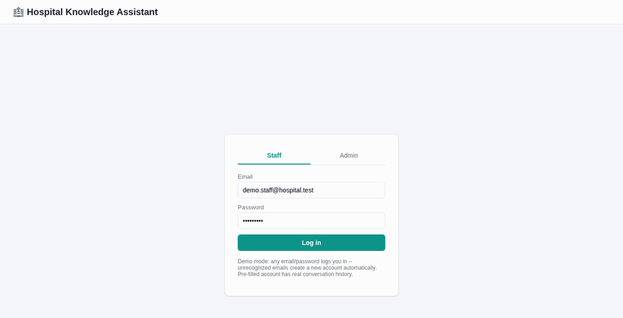

# hello_database

My hands-on database learning journal. The goal isn't to read about
databases — it's to build real, working, production-style backend
systems end to end until relational modeling, SQL, and backend
architecture stop being abstract and start being muscle memory.

Each project in this repo is a step up in difficulty from the last, and
each one is fully Dockerized with a Makefile you can use to learn it
interactively, one command at a time.

## Objective

Go from "I know what a database is" to "I can design, build, optimize,
and explain a real backend system" — by actually shipping one, not just
reading a chapter on normalization. Every project here follows the same
professional workflow: requirements → domain modeling → ER diagram →
normalized schema → seed data → a layered Python backend → the business
logic that makes a database project *hard* (transactions, concurrency,
constraints) → a web UI to see it work → tests for the failure modes →
`EXPLAIN`-backed optimization notes.

## The learning curve so far

```
docs/1.Database_Basics_Reference.md
   Relational vs NoSQL vs Vector DBs -- what each is for, when to
   reach for which. Theory foundation before writing any code.
        │
        ▼
mini_EcommerceDB/  (MySQL)
   Core relational modeling: normalization, foreign keys, CHECK
   constraints, ACID transactions, row-level locking to prevent
   overselling stock, the repository pattern.
        │
        ▼
EMS_DB/  (PostgreSQL)
   Leveled up to advanced SQL: CTEs, window functions, recursive
   queries, materialized views, JSONB, full-text search -- plus a
   two-role system (student/admin) and a richer domain (12 tables,
   3 views, 1 materialized view).
        │
        ▼
HospitalRAG_DB/  (PostgreSQL + pgvector)
   The "Vector DB" branch from the basics doc, built out for real:
   embeddings, chunking, semantic search, prompt construction, and
   an LLM answering only from retrieved context -- with citations,
   and an honest "I don't know" when nothing relevant exists.
```

---

## Project 1 — Mini E-Commerce Backend

**Stack:** MySQL 8 · Python (Flask, repository + service pattern) · Docker


Register → browse a catalog → cart → checkout → pay → order history.
The point of this project was the fundamentals: a normalized schema,
foreign keys and `UNIQUE`/`CHECK` constraints doing real enforcement
work, and a checkout flow that's genuinely transactional — `SELECT ...
FOR UPDATE` row locks so two customers can't both buy the last unit of
stock, with tests proving the whole thing rolls back cleanly when it
should.

**[→ mini_EcommerceDB/README.md](mini_EcommerceDB/README.md)** — Docker
quickstart, the web UI, and `make demo` for a narrated walkthrough of
every step from the terminal.

---

## Project 2 — Education Management System (EMS)

**Stack:** PostgreSQL 16 · Python (Flask, psycopg3) · Docker


A university backend: departments (with a real self-referential
hierarchy), courses with prerequisite chains, enrollment with
seat-locking, attendance, grading, fee payments gating certificate
issuance. This project's actual purpose was **advanced PostgreSQL**:
CTEs for reporting rollups, window functions for GPA rankings,
recursive CTEs for the department tree and prerequisite chains, a
materialized view refreshed on demand, JSONB for flexible assignment
settings, and full-text search over courses/teachers/students.

**[→ EMS_DB/README.md](EMS_DB/README.md)** — Docker quickstart, the
student portal + admin console, and `make demo` for a narrated
walkthrough touching every one of those PostgreSQL features.

---

## Project 3 — Hospital AI Knowledge Assistant (RAG)

**Stack:** PostgreSQL 16 + pgvector · Python (FastAPI, psycopg3) · a local embedding model + local LLM by default (no API key required) · Docker



A genre change from the first two: Retrieval-Augmented Generation
instead of CRUD. A staff member asks a question in a chat UI; the
system embeds it, runs a `pgvector` cosine-similarity search (backed by
an HNSW index) over chunked hospital documents, builds a grounded
prompt, and only then asks an LLM — with citations back to the source
chunks, and a deterministic refusal (not just a prompt instruction)
when nothing relevant was retrieved. The default embedding model and
LLM both run locally on CPU, so the whole thing works with zero API
keys; an OpenAI key is a drop-in upgrade, not a requirement.

**[→ HospitalRAG_DB/README.md](HospitalRAG_DB/README.md)** — Docker
quickstart, the chat UI, and `make demo` for a narrated walkthrough
(including a real local-LLM call).

## Repo layout

```
hello_database/
├── docs/
│   ├── 1.Database_Basics_Reference.md              Relational vs NoSQL vs Vector DBs
│   ├── 2.Mini_Ecommerce_Database_Project_Guide.md   The brief behind mini_EcommerceDB/
│   ├── 3.EMS_DB.md                                  The brief behind EMS_DB/
│   └── 4.Hospital_AI_Knowledge_Assistant_RAG_Roadmap.md   The brief behind HospitalRAG_DB/
├── mini_EcommerceDB/     Project 1 -- MySQL, transactions, the fundamentals
├── EMS_DB/               Project 2 -- PostgreSQL, advanced SQL, reporting
└── HospitalRAG_DB/       Project 3 -- PostgreSQL + pgvector, RAG, embeddings, LLMs
```
