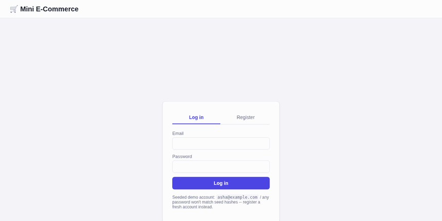

# Mini E-Commerce Backend

A production-style mini e-commerce backend built to the milestone
curriculum in [`docs/2.Mini_Ecommerce_Database_Project_Guide.md`](../docs/2.Mini_Ecommerce_Database_Project_Guide.md):
requirements → ERD → normalized MySQL schema → seed data → a Python
repository-pattern data access layer → a transactional checkout service →
a web UI on top of it → tests covering the required failure modes →
indexing backed by `EXPLAIN`.

Everything — database, backend API, and the web UI — runs from a single
`docker compose up`. No local Python environment or `venv` is required to
run it.



## Quickstart (Docker only)

```bash
cd mini_EcommerceDB
docker compose up -d --build
```

That one command starts two containers:

| Service   | What it is                                  | URL                          |
|-----------|-----------------------------------------------|-------------------------------|
| `mysql`     | MySQL 8, schema + seed data loaded automatically on first boot | `localhost:3307` (for a DB client) |
| `backend`   | Flask API + the web UI (static files served by the same app)     | **http://localhost:5000**    |

Open **http://localhost:5000** in a browser — that's the whole app.

Watch it come up:

```bash
docker compose ps                 # both should show "healthy" within ~30s
docker compose logs -f backend    # Ctrl+C to stop following
```

Stop everything (`-v` also deletes the MySQL data volume, i.e. a full reset):

```bash
docker compose down       # keep data
docker compose down -v    # wipe data and start clean next time
```

## Using the UI

1. **Log in** with any email and any password — this is a learning
   sandbox, not a real auth system, so the password is never checked.
   Typing an email that doesn't have an account yet creates one
   automatically (e.g. `asha@example.com`, one of the seeded accounts,
   or anything else). **Register** still works too, if you want to pick
   your own display name.
2. **Browse the catalog** — filter by category (`All / Electronics /
   Books / Home`) using the pill buttons above the product grid.
3. **Add to cart** — set a quantity and click *Add to cart* on any
   product card; adding the same product again increases its quantity
   instead of creating a duplicate line (try it).
4. **Cart sidebar** (right side) updates live — remove a line with the
   `×` button, see the running total, and **Checkout** once you have at
   least one item.
5. **Checkout** creates the order (atomically decrementing stock — try
   requesting more than the "in stock" count on a product to see the
   out-of-stock rejection) and opens the **payment modal**.
6. **Payment modal** — pick a method and click *Pay now*. Tick
   *"Simulate a declined payment"* first to see the failed-payment path:
   the order stays `pending` and the modal lets you retry immediately
   (retrying with the box unchecked pays it successfully — this exercises
   the same order+payment row, not a duplicate).
7. **Order History** tab — every past order with its line items, status
   badge (`pending` / `paid`), and payment outcome.

## Learn it interactively (Makefile)

Prefer the terminal over clicking? `make help` lists every step of the
same business flow as its own command — register, browse, add to cart,
checkout, pay, view history — each one printing the HTTP call *and* the
SQL/transaction happening underneath it:

```bash
make up      # start everything
make demo    # watch the full lifecycle happen, narrated, against a throwaway account
make db-shell   # then go look at the rows it just created yourself
```

Full guided tour, with the database concept each step is teaching (indexes,
constraints, transactions, row locking, rollback) and a set of
"break it on purpose" exercises: **[`docs/04_interactive_learning.md`](docs/04_interactive_learning.md)**.

### What each screen demonstrates

| Screenshot | Shows |
|---|---|
| `docs/screenshots/01_auth.png` | Login / Register screen |
| `docs/screenshots/03_catalog.png` | Full catalog, cart empty |
| `docs/screenshots/04_catalog_electronics.png` | Category filtering |
| `docs/screenshots/05_cart_filled.png` | Cart with multiple lines and a running total |
| `docs/screenshots/06_payment_modal.png` | Order created, awaiting payment |
| `docs/screenshots/07_payment_declined.png` | Simulated decline — order stays `pending` |
| `docs/screenshots/08_payment_success.png` | Retried payment succeeding on the *same* order |
| `docs/screenshots/09_order_history.png` | Order history after payment |
| `docs/screenshots/10_out_of_stock_error.png` | Checkout rejected — requested quantity exceeds stock |

## Running the tests (also Docker-only)

The test suite runs inside the same image as the backend, against the
`mysql` service — no local Python needed:

```bash
docker compose run --rm backend pytest -v
```

`tests/conftest.py` truncates every table before each test, so this
**wipes whatever you clicked through in the UI**. To get the demo data
back afterward:

```bash
docker exec -i mini_ecommerce_mysql mysql -uroot -prootpass mini_ecommerce < sql/02_seed.sql
```

(Or just `docker compose down -v && docker compose up -d --build` for a
full reset.)

## API reference

All endpoints are JSON and session-cookie authenticated (`/api/register`
or `/api/login` sets the session).

| Method & path | Purpose |
|---|---|
| `POST /api/register` | `{name, email, password}` → creates a user and logs in (409 on duplicate email) |
| `POST /api/login` | `{email, password}` → logs in; password isn't checked, and an unrecognized email auto-creates the account |
| `POST /api/logout` | Clears the session |
| `GET /api/me` | Current user, or 401 |
| `GET /api/categories` | All categories |
| `GET /api/products?category_id=` | Products, optionally filtered |
| `GET /api/cart` | Current user's cart lines + total |
| `POST /api/cart/items` | `{product_id, quantity}` → add/increment |
| `DELETE /api/cart/items/<product_id>` | Remove a line |
| `POST /api/checkout` | Atomically turns the cart into a `pending` order |
| `POST /api/orders/<id>/pay` | `{method, simulate_failure}` → attempt payment |
| `GET /api/orders` | Order history with items + payment status |

Domain errors (`OutOfStockError`, `DuplicateEmailError`,
`ProductNotFoundError`, `EmptyCartError`) are translated to `400/404/409`
JSON responses by a single `@app.errorhandler` in `python/app.py`, so the
UI's error toasts and the API's status codes come from one place.

## Layout

```
mini_EcommerceDB/
├── docs/
│   ├── 01_requirements.md     Module 0 — business requirement, entities, scope
│   ├── 02_er_diagram.md       Module 1 — ERD, normalization, constraints
│   ├── 03_optimization.md     Module 7 — EXPLAIN evidence for every index
│   ├── 04_interactive_learning.md   Guided tour of the Makefile learning path
│   └── screenshots/           UI walkthrough images + walkthrough.gif
├── sql/
│   ├── 01_schema.sql          Module 2 — tables, FKs, CHECK constraints, indexes
│   └── 02_seed.sql            Realistic seed data (users, products, one paid order)
├── Makefile                   `make help` — one target per learning step (see docs/04_...)
├── scripts/api_walkthrough.sh  Narrated end-to-end curl script behind `make demo`
├── Dockerfile                 Backend image: installs deps, serves API + UI via gunicorn
├── docker-compose.yml         mysql + backend, backend waits on mysql's healthcheck
├── python/
│   ├── app.py                 Flask API — thin HTTP layer over the repositories/services below
│   ├── demo.py                Scripted CLI walkthrough (register → pay → history)
│   ├── static/                index.html / style.css / app.js — the web UI
│   └── mini_ecommerce/
│       ├── db/connection.py       Pooled connections, transaction context managers
│       ├── models/                Plain dataclasses mirroring each table
│       ├── repositories/          Module 3-4 — one repository per entity, CRUD
│       ├── services/checkout_service.py   Module 6 — the transactional checkout flow
│       └── exceptions.py          Domain errors (OutOfStockError, etc.)
└── tests/                     Module 10 — pytest, one file per concern, runs via Docker
```

## What each failure test proves

| Guide requirement    | Test                                                              |
|-----------------------|--------------------------------------------------------------------|
| Duplicate email        | `tests/test_users.py::test_duplicate_email_rejected`              |
| Invalid product         | `tests/test_products.py::test_invalid_product_cannot_be_added_to_cart` |
| Out of stock             | `tests/test_checkout.py::test_checkout_out_of_stock_raises_and_rolls_back` |
| Rollback transaction      | `tests/test_checkout.py::test_checkout_with_multiple_products_one_out_of_stock_rolls_back_both` |
| Failed payment              | `tests/test_payments.py::test_failed_payment_leaves_order_pending` |
| Retry after failed payment  | `tests/test_payments.py::test_retrying_payment_after_decline_succeeds` |

The last one was caught by actually clicking through the UI: the first
version of `PaymentRepository.create` did a plain `INSERT`, so retrying a
declined payment hit the `UNIQUE(order_id)` constraint and crashed with a
500. Fixed with `INSERT ... ON DUPLICATE KEY UPDATE` so a retry overwrites
the prior failed attempt instead of conflicting with it — see
`python/mini_ecommerce/repositories/payment_repository.py`.

## Key design decisions

- **Price snapshotting**: `order_items.unit_price` is copied at checkout
  time, not looked up live from `products.price`, so historical orders
  never change if a product's price later changes. See
  `docs/02_er_diagram.md`.
- **Checkout vs. payment are separate transactions**: stock
  decrement + order creation is one atomic DB transaction; payment is a
  second step against an already-created order, so a slow/failing
  external payment gateway never holds database row locks open. A
  declined payment is retryable against the same order/payment row (see
  above). See the module docstring in
  `python/mini_ecommerce/services/checkout_service.py`.
- **Row-level locking** (`SELECT ... FOR UPDATE`) on both the cart lines
  and the product rows during checkout prevents two concurrent checkouts
  from overselling the same stock.
- **Repository pattern**: each table has one repository; repositories
  that need to participate in the checkout transaction (`product`,
  `cart`, `order`, `payment`) expose methods that accept the caller's
  connection, so the service layer controls the transaction boundary.
- **Password hashing is SHA-256 for demo simplicity** (`python/app.py`,
  `hash_password`) — called out explicitly because a real system needs
  bcrypt/argon2 with per-user salt, not a bare hash.
- **Login never actually checks the password, and auto-creates unknown
  emails** (`python/app.py`, `login`) — a deliberate choice for a
  learning sandbox where the interesting part is the cart/checkout/order
  flow, not gatekeeping. This is exactly the line a real system must not
  cross; flagged here so it's not mistaken for an oversight.
- **Session auth via signed cookies** (`Flask`'s built-in `session`) —
  enough to demonstrate "logged-in user" scoping for cart/orders without
  building a token/JWT layer the mini project doesn't need yet.

## Next milestones (from the guide's Module list)

Module 8 (real password hashing + roles/permissions), Module 9
(reporting/analytics queries — e.g. revenue per category, top
customers), and Module 10's remaining items (migrations, structured
logging, backups) are natural next steps once this core flow is
reviewed.
